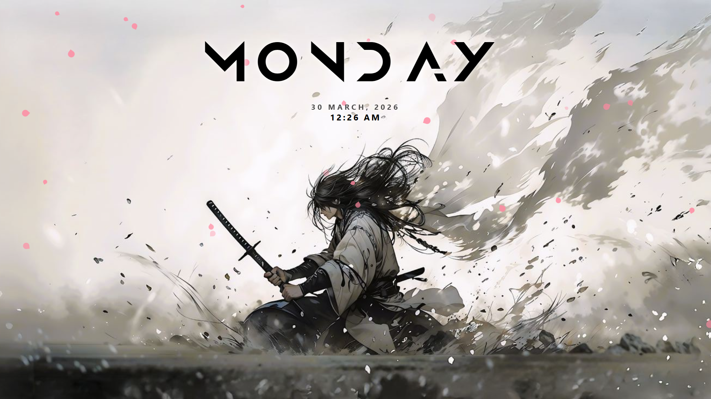
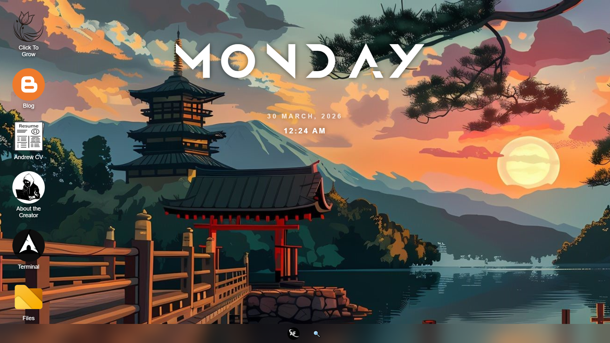

# Andrew OS – Web Desktop Environment




A modern **web-based desktop environment** that runs directly in the browser.
Samurai OS recreates the feel of a real operating system with a lockscreen, taskbar, desktop icons, and interactive windows.

The project is built to experiment with **UI design, window management, and desktop interactions using pure web technologies**.

---

## 🌐 Live Demo

👉 **Try Samurai OS in your browser:**
[View my live portfolio here!](https://andrew-fernando-15.github.io/Portfolio-3/)

---

## ✨ Highlights

* Custom **lockscreen interface** with clock and animated background
* Interactive **desktop environment**
* **Start menu** with application shortcuts
* **Taskbar with running apps**
* Draggable windows with:

  * Minimize
  * Maximize
  * Close buttons
* Desktop icons for:

  * Files (File Explorer)
  * GitHub
  * LinkedIn
  * Instagram
  * Portfolio projects
* Built-in **social profile popups** styled like real platforms

---

## 🧩 Tech Stack

* **HTML5** – structure of the desktop and windows
* **CSS3** – UI design, animations, layout
* **Vanilla JavaScript** – window system, drag behavior, app logic

No frameworks used — everything is built from scratch.

---

## ▶️ Running Locally

1. Clone the repository

```bash
git clone https://github.com/andrew-fernando-15/portfolio-3.git
```

2. Open the folder

3. Run

```
index.html
```

in your browser.

---

## 🚀 Future Improvements

* Improved File Explorer
* More desktop applications
* Window snapping system
* System settings panel

---

## 👨‍💻 Author

Andrew
Computer Engineering Student
Building creative interfaces and AI-powered tools.
